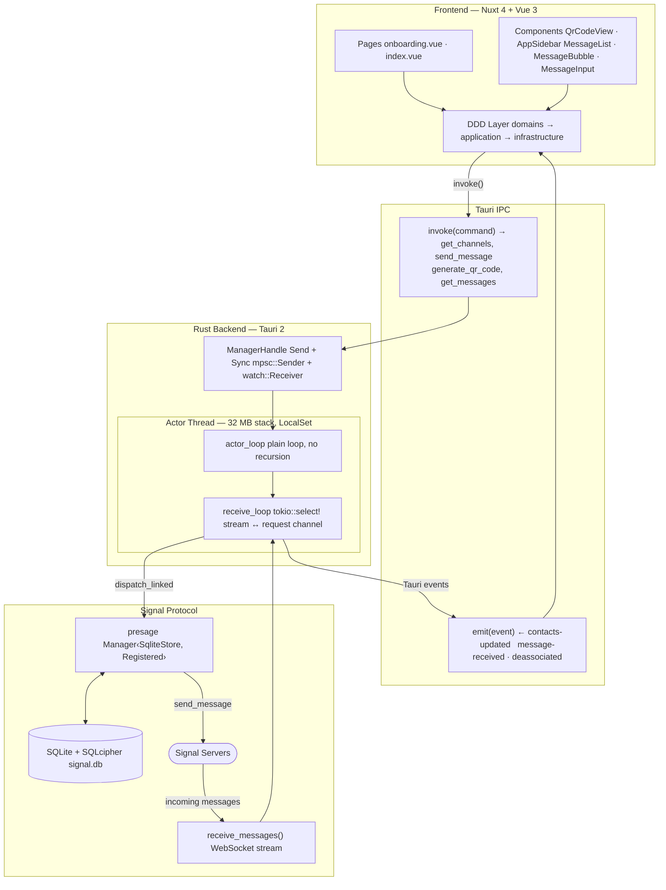

# Signal RS

[](https://tauri.app/)
[](https://vuejs.org/)
[](https://nuxt.com/)
[](https://ui.nuxt.com/)
[](https://github.com/features/actions)
[](https://pre-commit.com/)

A Signal desktop chat client built with Tauri 2 and [presage](https://github.com/whisperfish/presage), inspired by [gurk-rs](https://github.com/boxdot/gurk-rs). Replaces the terminal UI with a modern Nuxt 4 + Vue 3 interface.

## Features

- **QR code pairing** — link as a secondary device from your phone
- **Automatic re-pairing** — detects deassociation and shows a new QR code
- **Real-time messaging** — send and receive messages via Signal's WebSocket
- **Contact list** — contacts and groups synced from the local store, with last message preview (full sync requires receiving `Contacts` from the primary device)
- **Message history** — full conversation history from the local encrypted store
- **Multiline input** — Shift+Enter for new line, Enter to send
- **Dark theme** — Signal-inspired dark UI with Nuxt UI 4

## Architecture



## Getting started

```bash
# Install dependencies
task install

# Generate icons (requires src-tauri/icons/app-icon.png 1024×1024)
task icons

# Start in dev mode (Nuxt hot-reload + Tauri)
task up

# Run tests
task test

# Lint
task lint
```

On first launch, scan the QR code with Signal on your phone:
**Signal → Settings → Linked devices → Link a device**

## Available tasks

| Task | Description |
|------|-------------|
| `task up` | Start dev mode (Nuxt + Tauri with hot-reload) |
| `task test` | Run all tests (Rust unit/integration + Vitest) |
| `task lint` | Check Rust (clippy + rustfmt) + TypeScript |
| `task package` | Build production bundle (.dmg / .exe) |
| `task clean` | Remove all build artifacts |
| `task icons` | Regenerate icons from `src-tauri/icons/app-icon.png` |

## Contributing

### Setup

```bash
# Install pre-commit hooks
pre-commit install
pre-commit install --hook-type commit-msg
```

### Commit convention

This project enforces **[Conventional Commits](https://www.conventionalcommits.org/)** via [Commitizen](https://commitizen-tools.github.io/commitizen/).

```
<type>(<scope>): <short description>

Types: feat, fix, docs, refactor, test, chore, ci
```

Examples:

```bash
feat(signal): add group message support
fix(ui): scroll to bottom on new message
docs: update architecture diagram
```

Use `cz commit` for an interactive prompt, or write the message manually — the pre-commit hook will validate it.
